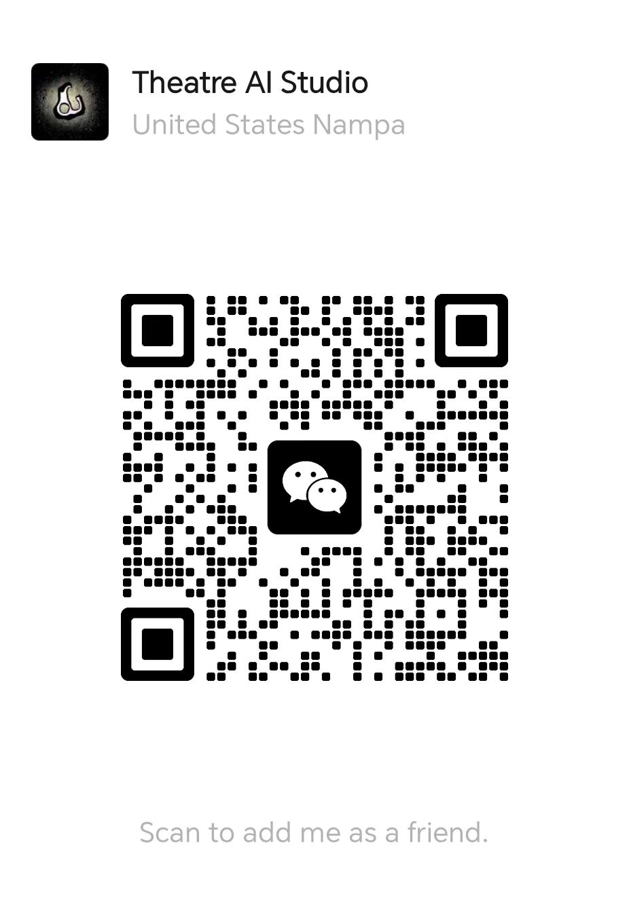

# 支持与服务

本项目开源免费，长期维护依赖社区支持。

---

## 打赏支持

如果这个 skill 帮你节省了大量手动整理字幕的时间，欢迎随喜打赏，支持持续迭代。

  
   
  扫码添加微信好友 — 打赏 / 入群 / 咨询

---

## 交流群

扫码添加好友后，回复 "youtube-skill" 即可入群。

群内提供：
- 使用问题解答与故障排查
- 新功能内测与优先体验
- 与其他用户的经验交流
- 定制需求讨论

---

## 定制服务

如果你有更复杂的需求，可以提供一对一定制：

| 服务类型 | 说明 | 预估工时 |
|---------|------|---------|
| 私有 skill 定制 | 针对特定领域（如医学、法律、编程）定制专属翻译风格与术语表 | 按项目报价 |
| 批量视频处理 | 一次性处理 10+ 个视频，自动化流水线部署 | 按量报价 |
| 企业部署 | 团队内部私有化部署，集成到企业知识库 | 按项目报价 |
| 教学咨询 | 1 对 1 指导 Claude Code + Obsidian + AI 工作流搭建 | 按小时计费 |

有意向请直接微信联系，备注 "定制服务"。

---

## 反馈与贡献

发现 bug 或有功能建议？

- 直接在 [GitHub Issues](https://github.com/LIPO1024/youtube-bilingual-transcript/issues) 提交
- 或通过微信群反馈

欢迎 Pull Request。贡献前请先阅读 `skill.md` 了解完整处理流程。

---

## 长期维护计划

- **v1.x**（当前）：稳定支持 YouTube 双语字幕整理
- **v2.x**（规划中）：支持 Bilibili、TED、网易云课堂等更多平台
- **v3.x**（远期）：集成 Whisper 本地 ASR，支持无字幕视频

维护进度与版本更新会在微信群内同步。
